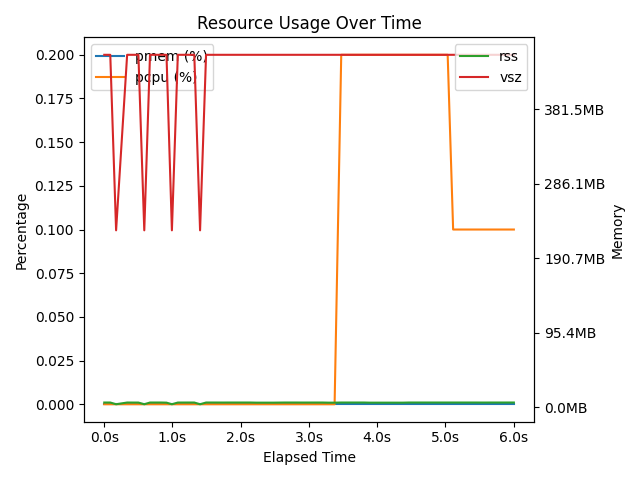
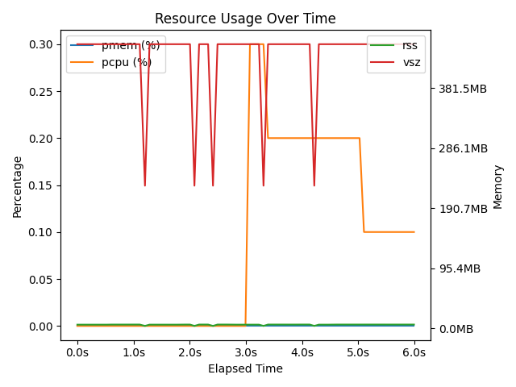

# Gallery

## Entry: example-1

```bash
#!/bin/bash
# Test fixture command - uses real duct execution
# Use a command that runs long enough to generate usage data
duct -p .duct/run -- bash -c 'for i in {1..5}; do echo "Step $i"; sleep 0.2; done'
exit 0
```



---

## Entry: example-2

```bash
#!/bin/bash
# Test fixture command - uses real duct execution
# Use a command that runs long enough to generate usage data
duct -p .duct/run -- bash -c 'for i in {1..3}; do echo "Processing $i"; sleep 0.3; done'
exit 0
```



---
